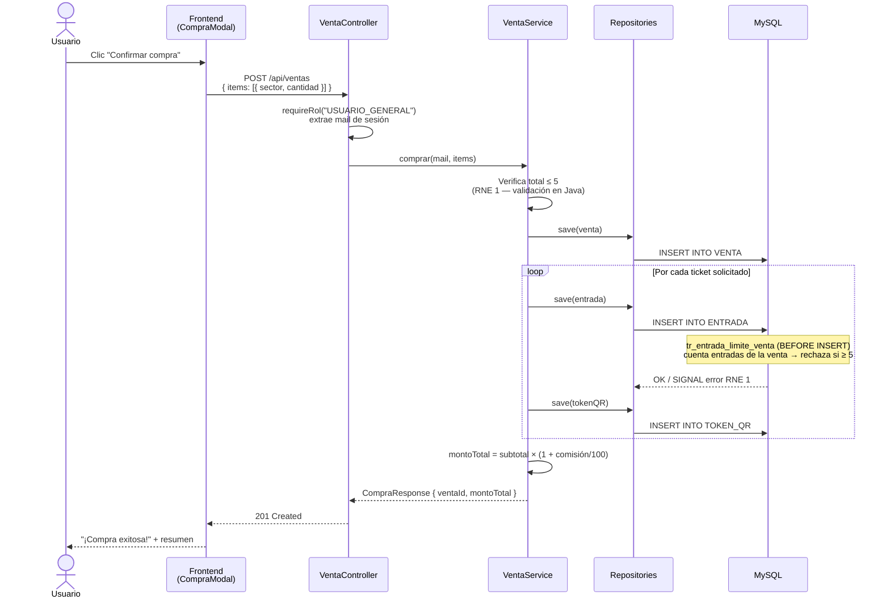

```mermaid
sequenceDiagram
    actor U as Usuario
    participant FE as Frontend<br/>(CompraModal)
    participant CTR as VentaController
    participant SVC as VentaService
    participant REP as Repositories
    participant DB as MySQL

    U->>FE: Clic "Confirmar compra"
    FE->>CTR: POST /api/ventas<br/>{ items: [{ sector, cantidad }] }

    CTR->>CTR: requireRol("USUARIO_GENERAL")<br/>extrae mail de sesión

    CTR->>SVC: comprar(mail, items)

    SVC->>SVC: Verifica total ≤ 5<br/>(RNE 1 — validación en Java)

    SVC->>REP: save(venta)
    REP->>DB: INSERT INTO VENTA

    loop Por cada ticket solicitado
        SVC->>REP: save(entrada)
        REP->>DB: INSERT INTO ENTRADA
        Note over DB: tr_entrada_limite_venta (BEFORE INSERT)<br/>cuenta entradas de la venta → rechaza si ≥ 5
        DB-->>REP: OK  /  SIGNAL error RNE 1

        SVC->>REP: save(tokenQR)
        REP->>DB: INSERT INTO TOKEN_QR
    end

    SVC->>SVC: montoTotal = subtotal × (1 + comisión/100)

    SVC-->>CTR: CompraResponse { ventaId, montoTotal }
    CTR-->>FE: 201 Created
    FE-->>U: "¡Compra exitosa!" + resumen
```
